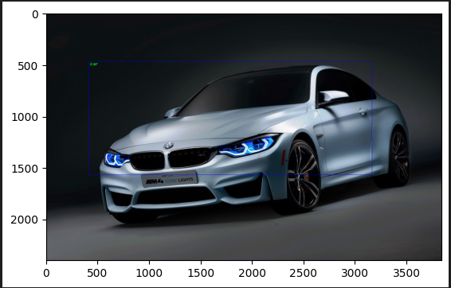

# Object Detection using SSD MobileNet V3
## Project Overview
This project showcases a powerful object detection pipeline using the pre-trained SSD MobileNet V3 model on the COCO dataset. Object detection allows computers to detect and recognize objects from images and videos. The SSD MobileNet model is known for its efficiency and accuracy, making it suitable for real-time object detection tasks.

This project includes:

- Loading a pre-trained object detection model.
- Detecting objects in images or videos.
- Annotating detected objects with bounding boxes and class labels.
- Visualizing results in a user-friendly format.

## Features
- Real-time Object Detection: Detect objects from live video streams or image sequences.
- Fast & Lightweight Model: SSD MobileNet is optimized for both performance and accuracy.
- Pre-trained on COCO dataset: Can recognize 80 different object classes like people, animals, cars, etc.
- OpenCV Integration: Leverages OpenCV's DNN module for easy deployment.

## Requirements and Installation

### Prerequisites

Make sure your system meets the following prerequisites before running the project:

- Operating System: Any OS with Python support (Windows, macOS, Linux)
- Python Version: 3.6 or above
- Jupyter Notebook: Required to run the .ipynb file.

### Python Libraries
To run the project, you need to install the following libraries:

- OpenCV: Open-source computer vision library for object detection.
- Matplotlib: Used for visualization of detected objects.
Install the dependencies by running the following commands:
```
pip install opencv-python-headless matplotlib
```
If you don't have Jupyter Notebook installed, you can install it using:
```
pip install notebook
```

### Directory Structure
You need to place the following files in the same directory:

```
/Object-Detection
    ├── obj-dect.ipynb                                 # The main Jupyter notebook
    ├── ssd_mobilenet_v3_large_coco_2020_01_14.pbtxt   # Model configuration file
    ├──frozen_inference_graph.pb                       # Pre-trained model file
    ├──bmw-m4.jpg                                      # sample image
    ├──1721294-hd_1920_1080_25fps.mp4                  #sample video
    └──Labels.txt                                      # COCO class labels
    
```
Make sure to download or move the required files into the project folder to ensure smooth execution.

## Step-by-Step Guide
### 1. Cloning the Repository
First, clone the repository to your local machine or download the zip file.
```
git clone https://github.com/your-username/Object-Detection.git
cd Object-Detection
```
### 2. Running the Notebook
To run the object detection model, follow these steps:

1.Open the Jupyter Notebook in the terminal or command prompt:
```
jupyter notebook
```
2.Navigate to the directory where the obj-dect.ipynb file is located.
3.Open the notebook and run the cells in sequence.
### 3. Model Description

This project uses SSD MobileNet V3 from TensorFlow’s object detection model zoo, pre-trained on the COCO dataset.

- SSD (Single Shot Multibox Detector): Efficient object detection algorithm.
- MobileNetV3: Lightweight model architecture ideal for mobile and embedded vision applications.
- COCO dataset: Common dataset with 80 classes, including everyday objects like person, bicycle, car, etc.

### 4. Using the Model

- Loading the Model: The model and its configuration file are loaded using OpenCV's `cv2.dnn_DetectionModel`.
- Labeling Objects: The `Labels.txt` file contains the class names corresponding to the detected objects.
- Visualizing Results: Detected objects are annotated with bounding boxes, class names, and confidence scores.
```
import cv2
import matplotlib.pyplot as plt


# Load model and config
model = cv2.dnn_DetectionModel('frozen_inference_graph.pb', 'ssd_mobilenet_v3_large_coco_2020_01_14.pbtxt')
model.setInputSize(320, 320)
model.setInputScale(1.0 / 127.5)
model.setInputMean((127.5, 127.5, 127.5))
model.setInputSwapRB(True)

# Load class labels
classLabels = []
with open('Labels.txt', 'rt') as fpt:
    classLabels = fpt.read().rstrip('\n').split('\n')
```

## Sample Output
When you run the project, you will see images or video frames with bounding boxes drawn around the detected objects. The label of the detected object and its confidence score will also be displayed.

Sample output from object detection:




## Customization
### 1. Use your own images or videos
You can replace the image or video file paths in the notebook to detect objects in your custom media:
```
img = cv2.imread('your-image.jpg')
video = cv2.VideoCapture('your-video.mp4')
```
### 2. Adjust Detection Parameters
You can tweak parameters like confidence threshold or model input size to balance accuracy and performance for your specific application.

```
model.setInputSize(300, 300)  # Adjust for speed vs accuracy
model.setInputSwapRB(True)    # Adjust color channel swapping
```
## Troubleshooting

- 1.Model not found error: Ensure that the frozen_inference_graph.pb and ssd_mobilenet_v3_large_coco_2020_01_14.pbtxt files are in the same directory as the notebook.
- 2.Incorrect paths: Double-check file paths for images, videos, and model files.
- 3.Missing dependencies: Ensure all required Python libraries are installed (use pip list to verify).

## Contributing
Contributions are welcome! Feel free to open issues or submit pull requests. You can contribute by:

- Adding more sample images or videos for testing.
- Improving the detection accuracy by fine-tuning the model.
- Extending the project to detect objects in real-time via a webcam or live video feed.
